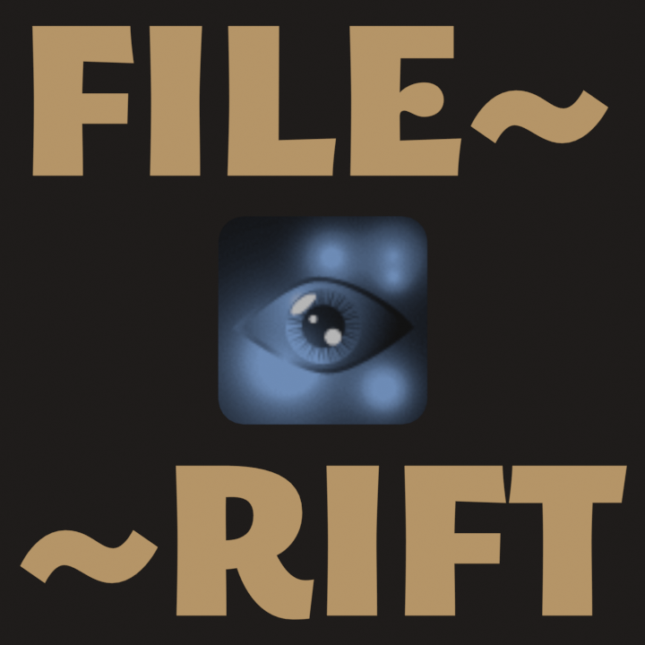

<h3 align="center">
    
</h3>

## Overview
FileRift is a decoder/recoder for Swordigo's Protocol Buffers (pb) files. These files include:
- `*.scene`: level data
- `*.scl`: libraries containing objects that can be used in `.scene` files
- `*.gdata`: definitions for collectibles, spells, quests etc.
- `*.gstate`: default state for new games
- `*.gplayer`: savegames
- `*.gopt`: names for music tracks, as well as the default touch controls layout
- `*.sounds`: names for sound effect tracks
- `*.scmap`: in-game map layout
- `*.atlas`: texture mapping files
- `*.fnt`: font mapping files

FileRift has two modes: decode and recode. In decode mode, FileRift will convert Swordigo binary files into a custom plain text format, which looks similar to a markup language. In recode mode, FileRift will convert those plain text files back into binary files which can be added into the game. Normally, FileRift will decode the original game files, however it can decode or recode any Swordigo files you give it.

## Usage
Clone the repo or download a release. Run `FileRift.py` using Python 3.
```bash
python3 FileRift.py
```
To change the rift mode, open config.py in an editor and change the value of the string `rift_mode`. Valid options are `"decode"`, `"recode"`, `"both"`, `"user"` and `pass`. `"user"` mode is the same as decode, but it only searches the `/de_in/<user_folder>` folder, `user_folder` is configured in config.py. In `pass` mode, no decoding or recoding is done. You can also set the rift_mode using command-line flags, see below.
All files in `/de_in` are used as input files for the decoder. The folders `all`, `scene` and `scl` are intended for the original game files. Any folders you make will be scanned when rifting, and all output files will be placed in `/de_out`.  
All files in `/re_in` are used as input files for the recoder. Any folders you make will be scanned when rifting, and all output files will be placed in `/re_out`.  
More on command-line flags in a later section.

To get a list of command-line flags, use `python3 FileRift.py --help`. Example output:

```bash
usage: FileRift [-h] [-r [RECODE ...]] [-d [DECODE ...]] [-u] [--both] [-f [FORCE ...]] [-b]
                [--build-project BUILD_PROJECT] [-o OUTPUT] [-i [INFO]] [-n] [-t FILE_TYPE]
                [--working-dir WORKING_DIR] [--recode-stdin] [--decode-stdin]

options:
  -h, --help            show this help message and exit
  -r [RECODE ...], --recode [RECODE ...]
                        run in recode mode
  -d [DECODE ...], --decode [DECODE ...]
                        run in decode mode
  -u, --user            decode file in /de_in/user, unless otherwise specified
  --both                run in recode then decode mode
  -f [FORCE ...], --force [FORCE ...]
                        run in recode mode with allways_recode turned on
  -b, --build           build an apk from the default project file
  --build-project BUILD_PROJECT
                        build an apk from the specified project file
  -o OUTPUT, --output OUTPUT
                        output path for (d|r)ecoded files
  -i [INFO], --info [INFO]
                        get info about block_formats, templates and more
  -n, --no-colour       disable ansii colour codes in output
  -t FILE_TYPE, --file-type FILE_TYPE
                        set filetype for block_formats
  --working-dir WORKING_DIR
                        set the working directory
  --recode-stdin        recode from stdin
  --decode-stdin        decode from stdin

```

When recoding, Rift will check the contents of every file against a checksum stored in `lib/.manifest`. If the checksum matches, the file will be skipped, saving a lot of time when recoding. To turn off this behaviour, use the `--force` flag, or set `allways_recode` to True in `config.py`.

## Building apks

FileRift can build and sign an apk for you, adding and/or recoding the required files, then optionally install it. **Important: you need to have java installed and in your PATH**. Trigger this functionality by setting rift_mode to "build" in `config.py`, or by using the `--build` flag.
Start by making a `.frproject` file in the `projects` folder. This file defines what apk to use, which files to add and recode and the command to execute after signing. You can look at `projects/example.frproject` to see how the syntax looks. To select a project, change set `project_name` in `config.py` to the name of the project file, without the file extension. So to select `projects/hello.frproject`, set it to "hello". You can also select the project by using the `--build-project` flag followed by the name:
```
python3 FileRift.py --build-project hello
```
If you trigger building by using the `-b` or `--build` flags, you will by prompted for the project name.

## Configuration

Configuring FileRift is done using `config.py`. Most of the settings have comments explaining them.

## Syntax
FileRift decodes files into a custom format, which looks similar to a markup language.

```
# comment
A : 12 # integer
B : 15.9 # float
C : 'abc' # string
D{ # message
    A : 1
}
```

The files are split up into records, with each record consisting of a tag and some data.
The tag is the key for a record, and specifies what information that record represents. Tags should be surrounded by whitespace, but not quotes.  
There are four main types of record: integer, float, string and message. The first three work the same as in pretty much any markup language, and messages simply contain other records.
If you put a `d` after a float, it will be automatically converted from degrees to radians. `90d`

Integers are all decimal digits, no decimal points allowed. `0` `1500`
Floats may have decimal points, but they don't have to. `0.0` `.5` `20`
Strings are surrounded by single quotes `'` or double quotes `"`.  
Messages begin and end with braces. `{}`

## Lua Chunks

scene and scl files often contain Lua chunks, which are represented like this:
```
String : $
-- some lua here
$end
```

A Lua chunk always comes in a pair, with a 64-bit chunk and a 32-bit copy:
```
Program{
    String : $ ... $end    # 64-bit
    Bytes : ''  # 32-bit
}
```
The Bytes chunk is always pre-compiled, which makes it practically impossible to edit. This means that mods which utilize Lua chunks usually only work on 64-bit devices. FileRift can compile the String chunk for you, and add the output of the compilation to the secondary chunk. To trigger this, use the `@compile` or `@comp` trigger:
```
String : $ ... $end
Bytes : @comp
```
As FileRift runs through your files, it keeps the content of the last chunk, and when it finds `@compile`, it compiles the last chunk and adds it to that record. Be careful, if you use `@compile` in the wrong place, it will add the content of a random chunk to your record.  
> Note: this feature currently only works on Linux.

## Templates

The purpose of templates is to make writing re_in files easier by abstracting common things. When you reference a template in a `re_in` file, the contents of the template are copied into your file, with some parts replaced.

Here's how the contents of a template file might look:
```yaml
# templates/obj.fr
Object{
    TemplateName : '$1',
    Identifier : '$2',
    Position{
        X : $3,
        Y : $4,
    }
    Depth : $5,
    Rotation : $6,
    Scaling : $7,
    Hidden : 0,
}
```

And this is how you would reference that template in your re_in file:
```yaml
$obj[statue_knight; knight1; -256; 128; 0; 0; 1]
```

That would be the same as writing:
```yaml
Object{
    TemplateName : 'statue_knight',
    Identifier : 'knight1',
    Position{
        X : -256,
        Y : -128,
    }
    Depth : 0,
    Rotation : 0,
    Scaling : 1,
    Hidden : 0,
}
```

Basically, all the $x marks were replaced with the arguments in the templte reference.


Template files are placed in `/templates`. The name of the file defines how it will be referenced, for instance if you name your template file `chunk` or `chunk.fr` it can be referenced as `$chunk[...]`.  
The filename must be made up of lower case letters and dots. Note that the extension .fr will be removed automatically, but not any other extension.  
You can use directories for template files, but the path to the file is not used in the reference, e.g. `/templates/nt/proj/npc` is referenced as `$npc[...]`. This means that `/templates/a` is the same as `/templates/d/a`.  

## Tag Info

Tag info helps you to write Swordigo files quickly, by showing what record tags are allowed in a message. Run Rift with the `-i` flag, and pass a message name like so:

```
python3 FileRift.py -i Position

Position (message)
   0d : X (float)
   15 : Y (float)
```

This tells you that the Position Message contains two records, `X` and `Y`, both floats. Now you know that you can write a Position message like this:
```
Position{
    X 201.5
    Y 5518.25
}
```

You can also pass a filename and line number. Rift will find the file, go to the line number and see what tag is present on that line, then show info for that tag like so:
```
python3 FileRift.py -i re_in/testing/beyond_graveyard.scene:4

Object (message)
   0a : TemplateName (str)  [optional] reference to a template to initialize the object from
   12 : Identifier (str)  used to refer to this object
   1a : Component (message)
   22 : Position (message)
   2d : Depth (float)
   35 : Rotation (float)
   3d : Scaling (float)
   42 : LocalAabb (message)
   48 : Hidden (int)
   52 : OnLoad (message)
```

You can also use some special codes to see helpful lists, we'll see some of these later. Use `python3 FileRift.py -i .help` to see a list.

## Template Info

Calling Rift with the `-i` flag and a template name preceded by a dot will print all the comments at the start of the template file, which typically contain the documentation for the template:

```
python3 FileRift.py -i .obj

usage: [name;ident;x_pos;y_pos;z_pos;rot;scale]
add an object instance with the provided details
```

You can use `python3 FileRift.py -i .list` to get a list of templates.

## Logging

If `logging` is set to `"all"` in `config.py`, all error messages which Rift outputs will also be added to `log.txt`.

## Exit Codes

When any errors are encountered, Rift will exit with a non-zero exit code. The meaning of the codes is as follow:
```
  0 = success
  1 = general error
  2 = argument error
  3 = config error
  4 = file not found error
  5 = decode error
  6 = recode error
  7 = filerift system error
```

You can also use `python FileRift.py -i .exitcodes to get a list of exit codes and their meanings.`

## Triggers

Triggers are keywords which you can put in re_in files to trigger special behaviours. The special `@compile` keyword seen [#LuaChunks] is a trigger. They are as follows:

- `@compile:` (a.k.a. `@comp`), compile the previous lua chunk and add it to a string
- `@line:` print line number
- `@halt:` pause recoding, wait for input
- `@stop:` stop recoding, write output to file
- `@print:` display all globals, all locals or the value of a local variable

The `@print` trigger takes in argument like this: `@print(metalevel)`. You can pass it any `recode.py` or either the word "globals" or the word "locals".
All triggers except `@compile` are essentially for trouble-shooting re_in files, and FileRift itself. You can see a list of triggers using `python FileRift.py -i .triggers`.
